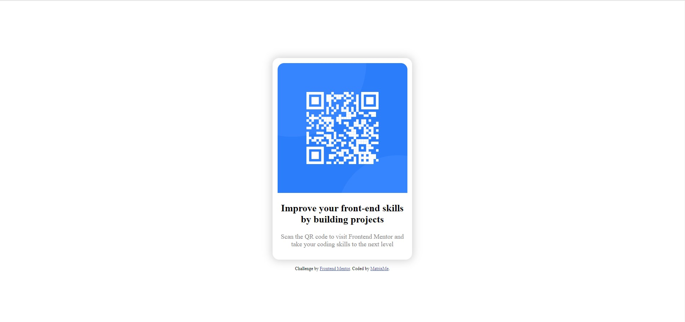

# Frontend Mentor - QR code component solution

This is a solution to the [QR code component challenge on Frontend Mentor](https://www.frontendmentor.io/challenges/qr-code-component-iux_sIO_H). Frontend Mentor challenges help you improve your coding skills by building realistic projects. 

## Table of contents

- [Overview](#overview)
  - [Screenshot](#screenshot)
  - [Links](#links)
- [My process](#my-process)
  - [Built with](#built-with)
  - [What I learned](#what-i-learned)
- [Author](#author)

## Overview

### Screenshot



### Links

- Solution URL: [Frontend Mentor](https://www.frontendmentor.io/solutions/qr-code-card-O5k9sJLYvv)
- Live Site URL: [Github](https://matrixme00.github.io./FrontendMentor/cards/qrcode/)

## My process

### Built with

- CSS custom properties
- Flexbox

### What I learned

learned to create a simple flexbox card without the help of any css library

```css
.card{
      display: flex; align-items: center; justify-content: center;
      flex-direction: column; padding: 0.75rem; border-radius: 1rem;
      margin-bottom: 1rem; box-shadow: 0 0 1.25rem 0.2em lightgrey; width: fit-content;
      text-align: center;
    }
```

## Author

- Frontend Mentor - [@MatrixMe00](https://www.frontendmentor.io/profile/matrixme00)
- Twitter - [@MatrixMe2](https://www.twitter.com/matrixme2)
